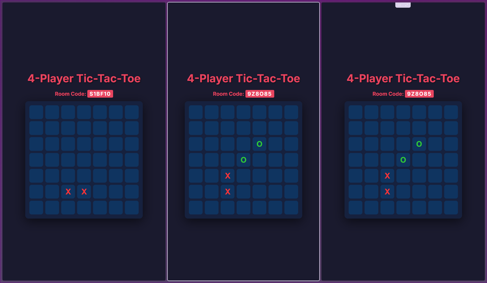
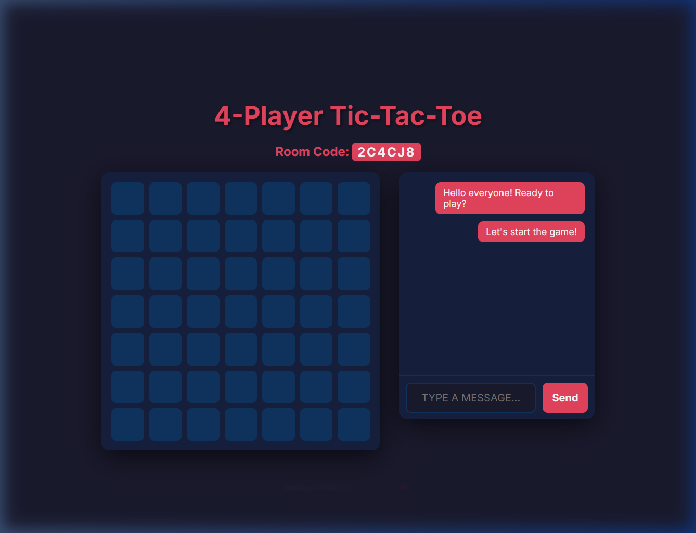

# 4-Player Tic-Tac-Toe 🎮



A real-time, online 4-player version of classic Tic-Tac-Toe built with Node.js, Express, and Socket.io. 

## The Story

This project was built entirely using **Antigravity**, an advanced AI coding assistant from Google. I decided to code this project as a test of its capabilities, and I am very impressed with the results! Antigravity helped architect the server, write the real-time game logic, design the dynamic user interface, and even guided me through the process of publishing it to GitHub. Even this Readme was written by AI.

## Features

- **Game Rooms:** Create or join private game rooms using unique 6-character room codes.
- **In-Game Chat:** Chat with other players in your room in real-time, with messages color-coded to match player symbols.
- **Real-Time Multiplayer:** Up to 4 players can connect simultaneously and play together in real-time.
- **Dynamic Board:** The board automatically adjusts depending on the current game state.
- **Player Assignments:** Players are automatically assigned unique symbols (X, O, ▲, ■) and colors upon joining.
- **Spectator Support:** If the game room is full, additional users are notified that they cannot join.



## Technologies Used

- **Backend:** Node.js, Express
- **Real-time Communication:** Socket.io
- **Frontend:** HTML5, Vanilla CSS, Vanilla JavaScript

## How to Run Locally

1. Clone the repository:
   ```bash
   git clone https://github.com/thewackyworld/4-player-tictactoe.git
   ```

2. Navigate into the project directory:
   ```bash
   cd 4-player-tictactoe
   ```

3. Install the dependencies:
   ```bash
   npm install
   ```

4. Start the server:
   ```bash
   node server.js
   ```

5. Open [http://localhost:3000](http://localhost:3000) in your web browser. To test with 4 players, open 3 additional tabs or windows pointing to the same address.

## License
ISC
